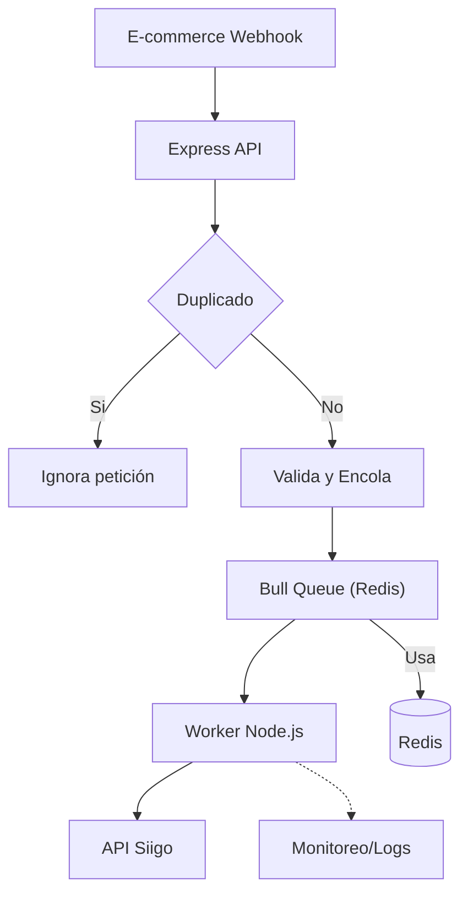

# Siigo Inventory Integration

## Descripción

Este proyecto es un **middleware** desarrollado en **Node.js + TypeScript** que actúa como puente entre un e-commerce y la API de Siigo. Su objetivo es recibir actualizaciones de inventario mediante webhooks, procesarlas de forma segura y eficiente, y enviarlas a Siigo, asegurando robustez ante sobrecarga, duplicados y caídas temporales.

### Características principales

- **TypeScript**: Código seguro y tipado.
- **Express**: API REST para recibir webhooks.
- **Bull + Redis**: Procesamiento asíncrono y tolerante a sobrecarga mediante colas.
- **Idempotencia**: Evita duplicados usando claves únicas por evento/producto.
- **Validación**: Payloads validados con Joi.
- **Rate Limiting**: Protección contra abuso de la API.
- **Docker & Docker Compose**: Fácil despliegue y escalabilidad.
- **Worker dedicado**: Procesamiento desacoplado de los webhooks.

---

## Estructura del Proyecto

```
/src
  /routes
    inventory.ts         # Endpoint para recibir webhooks de inventario
  /services
    inventory.ts         # Lógica de negocio, idempotencia y encolado
    queue.ts             # Configuración de Bull y Redis
    worker.ts            # Worker que procesa la cola y simula integración con Siigo
  /utils
    validate.ts          # Validación de payloads con Joi
  app.ts                 # Configuración principal de Express y rutas
Dockerfile               # Imagen de la app para producción
docker-compose.yml       # Orquestación de servicios (app, worker, redis)
tsconfig.json            # Configuración de TypeScript
```

---

## Tecnologías utilizadas

- **Node.js** y **TypeScript**
- **Express** (API REST)
- **Bull** (colas de trabajos)
- **Redis** (backend de Bull)
- **Joi** (validación de datos)
- **Docker** y **Docker Compose**
- **Axios** (para futuras llamadas HTTP a Siigo)
- **express-rate-limit** (protección de endpoint)

---

## ¿Cómo iniciar el proyecto?

### 1. Clona el repositorio y entra en la carpeta

```bash
git clone <url-del-repo>
cd siigo-integration
```

### 2. Instala las dependencias

```bash
npm install
```

### 3. Compila el proyecto

```bash
npm run build
```

### 4. Levanta todo con Docker Compose

Esto iniciará:
- La API (`app`)
- El worker de Bull (`worker`)
- Redis (`redis`)

```bash
docker-compose up --build
```

La API quedará disponible en:  
`http://localhost:3003/api/inventory/webhook`

### 5. En desarrollo

Puedes correr la API y el worker por separado:

```bash
npm run dev           # API en modo desarrollo
npx ts-node src/services/worker.ts   # Worker en modo desarrollo
```

---

## Ejemplo de uso

**Request:**
```http
POST /api/inventory/webhook
Content-Type: application/json

{
  "productId": "123",
  "quantity": 2,
  "orderId": "A001"
}
```

**Respuesta exitosa:**
```json
{
  "message": "Inventory processed"
}
```

---

## Integración con siigo (ejemplo)

Para integrar realmente con la API de Siigo, debes modificar el worker para hacer la llamada HTTP a Siigo usando Axios. Ejemplo básico:

```ts
// src/services/worker.ts
import axios from 'axios';

inventoryQueue.process(async (job: Job<InventoryPayload>) => {
  const data = job.data;
  // Transforma la data según lo que espera Siigo
  const siigoPayload = {
    // ...transformación aquí...
  };
  try {
    const response = await axios.post('https://api.siigo.com/v1/inventory', siigoPayload, {
      headers: {
        Authorization: `Bearer <TU_TOKEN_SIIGO>`
      }
    });
    console.log('Actualización exitosa en Siigo:', response.data);
  } catch (error) {
    console.error('Error al actualizar Siigo:', error.response?.data || error.message);
    // Aquí puedes reintentar, loggear o manejar el error según tu lógica
  }
});
```

- Consulta la [documentación oficial de la API de Siigo](https://siigoapi.docs.apiary.io/#) para ver el formato exacto del payload y los headers requeridos.
- Puedes agregar lógica de reintentos, logs avanzados, o notificaciones según tus necesidades.

---

## Diagrama de arquitectura

